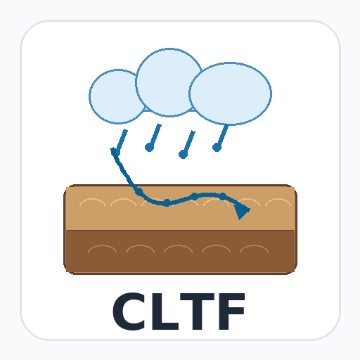

# Herbicide Dynamics Simulated by the Convective Lognormal Transfer Function (CLTF) in Python and R

This repository contains paired Python and R implementations of the Convective
Lognormal Transfer Function (CLTF) model for herbicide dynamics in two soil
layers. The current workflow uses the R implementation as an independently
verified reference and maintains a Python implementation plus Streamlit
workbench with shared data, tests, and examples.

The primary target quantity is layer-average resident concentration in
`µg/kg dry soil`, following the sampled-data structure. The webapp and examples
currently support historical analysis over observed SILO climate periods.

## Repository layout

```text
cltf/
├── R/                         # R package: cltf
├── python/                    # Python package: cltf
│   ├── src/cltf/              # Python implementation
│   └── tests/                 # Python and cross-language tests
├── examples/
│   ├── R/                     # R reference-case runner
│   ├── python/                # Python reference-case runner
│   └── data/                  # Shared NSW and SA inputs
├── apps/herbicide_workbench/  # Streamlit CLTF workbench
├── reference/                 # Committed reference outputs and tolerances
├── requirements.txt           # Python runtime dependencies
└── requirements-workbench.txt # App/test dependencies
```

## Install and test

Python:

```bash
pip install -r requirements.txt
PYTHONPATH=python/src python -m pytest python/tests -q
```

R:

```bash
Rscript -e 'testthat::test_local("R")'
```

Workbench:

```bash
pip install -r requirements-workbench.txt
streamlit run apps/herbicide_workbench/app.py
```

## Shared examples

NSW Griffith Heavy/Imazapic is the primary showcase case:

```bash
Rscript examples/R/run_reference_case.R \
  --case nsw_griffith_heavy_imazapic \
  --input-dir examples/data/nsw_griffith_heavy_imazapic \
  --output-dir /tmp/nsw-r

python examples/python/run_reference_case.py \
  --case nsw_griffith_heavy_imazapic \
  --input-dir examples/data/nsw_griffith_heavy_imazapic \
  --output-dir /tmp/nsw-python
```

SA Minnipa Heavy/Imazapic is retained as a secondary regression case:

```bash
Rscript examples/R/run_reference_case.R \
  --case sa_minnipa_heavy_imazapic \
  --input-dir examples/data/sa_minnipa_heavy_imazapic \
  --output-dir /tmp/sa-r

python examples/python/run_reference_case.py \
  --case sa_minnipa_heavy_imazapic \
  --input-dir examples/data/sa_minnipa_heavy_imazapic \
  --output-dir /tmp/sa-python
```

The shared examples run offline from committed SILO climate and SLGA-shaped
bulk-density inputs.

## Workbench

The Streamlit workbench uses the Python `cltf` package directly. Users select a
demo site, soil group, and herbicide, then either use the bundled example
observations or upload one observation CSV. Climate and soil inputs are prepared
automatically from committed caches, with optional SILO and SLGA refresh when
credentials are available.

Key app features:

- NSW Griffith and SA Minnipa site selectors;
- satellite map with attributed fallback basemap;
- one observation CSV upload;
- cached/API climate and bulk-density provenance;
- application-rate inference from positive top-layer T0 observations;
- adjustable residue assessment date, defaulting to 90 days beyond application;
- CLTF fit diagnostics, mass-balance diagnostics, and download artifacts.

Assessment dates are restricted to the observed climate period. Forecasting from
historical climatology is a planned future extension.

## Model assumptions and units

- The transport model is a two-layer CLTF with lognormal transfer functions.
- Retardation enters through the corrected `y / R` structure.
- Degradation is first-order over total elapsed time.
- Effective porosity is used as a concentration scaling factor.
- Water balance uses daily thresholded net infiltration:
  `max(rain + irrigation - PET * et_factor, 0)`.
- Resident concentrations are reported as `µg/kg dry soil`.

## Calibration note

The current CLTF equations identify the products `mu * R_top` and
`mu * R_bottom`, not `mu` and both retardation factors separately. Comparisons
between R and Python should therefore focus on forward predictions, objective
values, mass balance, and fitted transport scales unless additional constraints
resolve that scaling ridge.

## References

Jury, W. A., & Roth, K. (1990). *Transfer Functions and Solute Movement
Through Soil*. Birkhäuser, Boston.
