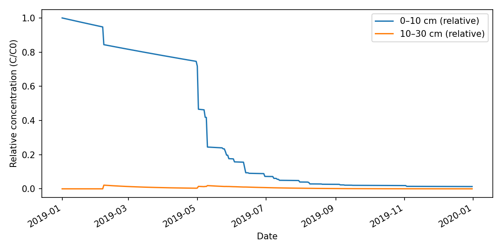

# pyCLT


Python translation of the Concentration Leaching and Transport (CLT) model used to simulate pesticide movement through soil layers. The original R code combined a simple water-balance with a two-layer residence-time model; this repo keeps the physics but improves structure and readability.

## Repo layout
```
pyCLT/
├── pyclt/                     # Core library
│   ├── __init__.py            # Public exports
│   ├── climate.py             # Radiation + Priestley–Taylor PET utilities
│   ├── infiltration.py        # Cumulative infiltration (rain − ET thresholding)
│   └── model.py               # Two-layer CLT model, parameters, run helper
│
├── examples/                  # Runnable examples/demos
│   ├── synthetic_demo.py      # Toy climate → ET → infiltration → CLT outputs (self-contained)
│   ├── bcg01_demo.py          # Demo using BoM-derived climate (needs generated CSV)
│   └── generate_bcg01_climate.py  # Build example/data/bcg01_2019_climate.csv from CLT_model/BoM/BCG01
│
├── examples/data/             # Example datasets
│   └── bcg01_2019_climate.csv # Daily Tmax/Tmin/rain for BCG01 (built from BoM files)
│
├── requirements.txt           # Python dependencies (pip)
└── README.md                  # Project overview & instructions
```

## What the model does
- Computes daily potential evapotranspiration (PET) from Tmax/Tmin using Priestley–Taylor radiation balance (no humidity required).
- Converts rainfall and ET to cumulative net infiltration (rain minus ET\*factor, thresholded at zero).
- Propagates a relative concentration signal through a two-layer soil profile (0–10 cm and 10–30 cm by default) using lognormal travel-time distributions with layer-specific retardation and decay.
- Produces relative concentrations (C/C0) over time for the surface and subsoil layers.

## Layout
- `pyclt/climate.py` — radiation and PET helpers (`pet_from_temp`, `calc_et`, `transmissivity`, etc.).
- `pyclt/infiltration.py` — simple cumulative infiltration calculation.
- `pyclt/model.py` — `CLTParameters`, `TwoLayerCLT`, and `run_series` for forward simulations.
- `examples/synthetic_demo.py` — self-contained demo that stitches climate → ET → infiltration → CLT outputs.
- `requirements.txt` — minimal dependencies (numpy, pandas; matplotlib optional for plotting).

## Quickstart (synthetic data)
```bash
cd /Users/yiyu/Library/CloudStorage/OneDrive-TheUniversityofSydney(Staff)/Work/Workspace/GitHub/pyCLT
python -m venv .venv && source .venv/bin/activate
pip install -r requirements.txt
python examples/synthetic_demo.py
```
The demo prints a head/tail of simulated concentrations and, if `matplotlib` is installed, pops up a plot of top vs. subsoil relative concentrations.

## Example with BoM data (BCG01)
We can derive a ready-to-use climate CSV from the raw BoM files already present in `CLT_model/BoM/BCG01`.
```bash
cd /Users/yiyu/Library/CloudStorage/OneDrive-TheUniversityofSydney(Staff)/Work/Workspace/GitHub/pyCLT
python examples/generate_bcg01_climate.py        # writes examples/data/bcg01_2019_climate.csv
python examples/bcg01_demo.py                    # runs CLT on that dataset
```
Expected outputs from `bcg01_demo.py`:
- `examples/data/bcg01_results.csv`: tabular time series with rain, ET0, cumulative infiltration, and relative concentrations (top/subsoil).
- `examples/data/bcg01_results.png`: time series plot of relative concentration in top (0–10 cm) and subsoil (10–30 cm).

<p>


<em>Demo results using BCG01 data.</em>
<p>

## Using your own data
1) Prepare a dataframe (or CSV) with at least:
   - `jdays`: day-of-year integer (1–366)
   - `Tmax`, `Tmin`: daily max/min air temperature in °C
   - `rain_mm`: daily rainfall in mm  
2) Compute ET0 and cumulative infiltration:
```python
import pandas as pd
from pyclt.climate import calc_et
from pyclt.infiltration import cumulative_infiltration

df = pd.read_csv("my_climate.csv")
df["et0_mm"] = calc_et(latitude_deg=-35.9, data=df)
df["cumulative_infiltration_mm"] = cumulative_infiltration(df["rain_mm"], df["et0_mm"], et_factor=1.0)
```
3) Run CLT forward:
```python
import numpy as np
from pyclt.model import CLTParameters, run_series

params = CLTParameters(mu=3.0, sigma=1.0, retardation_top=6, decay_top=0.0015,
                       retardation_bottom=8, decay_bottom=0.02, min_value=0.0001)
times = np.arange(len(df), dtype=float)  # days since application
top, bottom = run_series(times, df["cumulative_infiltration_mm"], params)
df["top_rel_conc"] = top
df["subsoil_rel_conc"] = bottom
```

## Notes and differences from the R script
- File paths are no longer hard-coded; you supply your own CSV/Excel sources.
- The model keeps the two-layer integration, linear depth-varying retardation in the lower layer, and simple exponential decay for each layer.
- Missing temperature handling and site-by-site calibration loops from the R script are not reproduced here; add them as needed around the provided functions.
- All computations are vectorised with numpy; defaults mirror the original R constants.
